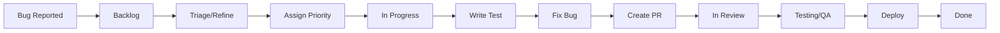
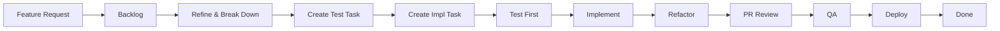
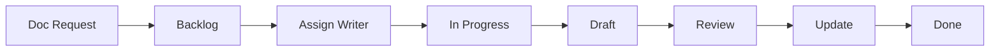

# Team Workflow Guide - Orbit IDP

Quick reference for using the GitHub Projects board and issue workflow.

## 🚀 Quick Start

### For New Issues

1. **Choose the right template**:
   - Bug? → [Bug Report](.github/ISSUE_TEMPLATE/bug.md)
   - New feature? → [Feature Request](.github/ISSUE_TEMPLATE/feature_request.md)
   - Documentation? → [Documentation](.github/ISSUE_TEMPLATE/documentation_request.md)
   - Internal work? → [Technical Task](.github/ISSUE_TEMPLATE/technical_task.md)

2. **Issue auto-moves to Backlog** (via automation)

3. **Team lead adds**:
   - Priority label (`priority:critical`, `priority:high`, etc.)
   - Service label (`service:repository`, `frontend`, etc.)
   - Effort estimate in project field
   - Phase label if applicable

4. **Refinement meeting**: Move to "Refined" when ready for sprint

## 📊 Project Board Views

### 🏃‍♂️ Sprint Board (Primary view)
- **Use for**: Daily standups, tracking current work
- **Shows**: All items in current sprint, grouped by Status
- **Filters**: Current sprint only

### 🔧 Service Kanban
- **Use for**: Visualizing work across services
- **Shows**: Active items grouped by Service/Area
- **Filters**: Excludes "Done" items

### 🧪 TDD Workflow
- **Use for**: Ensuring TDD compliance
- **Shows**: Test and implementation tasks by TDD Phase
- **Filters**: Tests and Technical Tasks only

### 📝 Backlog Refinement
- **Use for**: Sprint planning, grooming sessions
- **Shows**: All backlog items with priority and effort
- **Filters**: Backlog and Refined statuses

### 🐛 Bug Triage
- **Use for**: Prioritizing and assigning bugs
- **Shows**: All bugs grouped by priority
- **Filters**: Type = Bug

## 🔄 Standard Workflows

### Bug Workflow



**Steps**:
1. ✍️ Create bug using template
2. 🔍 Team triages: Add priority, service, effort
3. 📋 Move to "Refined" in backlog
4. 🏃 Assign to developer → "In Progress"
5. 🧪 Write failing test (TDD Phase: Test First)
6. 🔧 Implement fix (TDD Phase: Make it Pass)
7. ✨ Refactor (TDD Phase: Refactor)
8. 📤 Create PR → Auto-moves to "In Review"
9. ✅ Merge → Auto-moves to "Testing/QA"
10. 🚀 Verify → "Ready for Deploy"
11. 🎉 Deploy → Close issue → Auto-moves to "Done"

### Feature Workflow (TDD Required)



**Steps**:
1. ✍️ Create feature using template
2. 📋 Refine: Add acceptance criteria, break into subtasks
3. 🧪 Create test task: "Contract test for X" (label: `tdd-required`)
4. 🔧 Create implementation task: "Implement X" (links to test)
5. 🔴 **TDD Phase: Test First** - Write failing test
6. 🟢 **TDD Phase: Make it Pass** - Implement feature
7. 🔵 **TDD Phase: Refactor** - Improve code quality
8. 📊 Update Test Coverage % field (target: 90%+)
9. 📤 Create PR → "In Review"
10. ✅ Code review + test review
11. 🚀 QA → Deploy → Done

### Documentation Workflow



**Steps**:
1. ✍️ Create doc request using template
2. 👤 Assign technical writer or developer
3. 📝 Move to "In Progress"
4. ✏️ Write content (markdown, diagrams, examples)
5. 📤 Create PR → "In Review"
6. 👀 Review for accuracy, clarity, completeness
7. ✅ Merge → "Done"

## 🏷️ Labeling Strategy

### When to Add Labels

**At Creation**:
- Template auto-adds: `bug`, `feature`, `documentation`, or `tech-task`

**During Triage**:
- **Priority**: Always add one (`priority:critical` → `priority:low`)
- **Service**: Add all applicable services (`service:repository`, `frontend`, etc.)
- **Phase**: Add if part of structured rollout (`phase:tdd`, `phase:implementation`)

**During Development**:
- `blocked` - If dependencies block progress
- `ready-for-review` - When PR is ready (auto-added by some workflows)
- `breaking-change` - If API changes affect consumers
- `needs-tests` - If test coverage is insufficient
- `performance-critical` - If performance targets apply
- `security-sensitive` - If security review needed

### Special Labels

**TDD Labels**:
- `tdd-required` - Must follow TDD workflow (write test first)
- Triggers automatic TDD Phase field update

**Performance Labels**:
- `performance-critical` - Triggers performance test requirements
- Fill "Performance Target" field with specific target

**Security Labels**:
- `security-sensitive` - Requires security review before merge
- Triggers additional checks in CI/CD

## 📈 Metrics & Tracking

### Test Coverage Tracking

**Target**: 90% business logic, 80% overall

**How to track**:
1. Run tests: `make test`
2. Check coverage report
3. Update "Test Coverage %" field in project
4. Ensure meets target before moving to "Testing/QA"

**Low coverage?**:
- Add `needs-tests` label
- Create subtask: "Add tests for X"
- Block PR until coverage improves

### Performance Tracking

**Targets**:
- API responses: <200ms p95
- Auth operations: <100ms
- Code generation: <30s

**How to track**:
1. Add performance test (e.g., `T024-T026` in tasks.md)
2. Set "Performance Target" field
3. Run perf tests: `make test-performance` (if configured)
4. Verify before "Ready for Deploy"

**Performance issue?**:
- Add `performance-critical` label
- Create optimization task
- Re-test and update metrics

## 🎯 Sprint Ceremonies

### Sprint Planning (Every 2 weeks)

**Agenda**:
1. Review "Backlog Refinement" view
2. Prioritize: Critical bugs → High-priority features → Tech debt → Docs
3. Balance work across Service/Area
4. Assign Effort, check team capacity
5. Assign to current Sprint iteration
6. Assign to developers

**Success criteria**:
- All sprint items have Priority, Service, Effort
- Total effort < team capacity
- No blockers or dependencies identified
- Everyone understands their tasks

### Daily Standup (15 min)

**Agenda**:
1. Open "Sprint Board" view
2. Walk through Status columns (right to left):
   - ✨ Done: What we completed
   - 🚀 Ready for Deploy: What's shipping soon
   - ✅ Testing/QA: What's being verified
   - 👀 In Review: What needs review (reviewers?)
   - 🏗️ In Progress: What's being worked on (blockers?)
   - 🔍 Refined: What's up next
3. Identify blockers (add `blocked` label)
4. Update TDD Phase for in-progress items
5. Assign reviews if needed

### Backlog Refinement (Weekly)

**Agenda**:
1. Open "Backlog Refinement" view
2. Review new issues (filter: Status = Backlog)
3. Add Priority, Service/Area, Effort
4. Break down large items (XL → multiple M/L tasks)
5. Ensure TDD tasks exist for testable work
6. Move refined items to "Refined" status
7. Close duplicates or stale issues

**Definition of Refined**:
- Clear acceptance criteria
- Priority assigned
- Service/Area identified
- Effort estimated
- Dependencies documented
- Test approach defined (if `tdd-required`)

### Retrospective (End of sprint)

**Agenda**:
1. Review "Done" items (what shipped?)
2. Check Test Coverage metrics (met targets?)
3. Review Performance metrics (met SLOs?)
4. Identify blockers and patterns
5. Process improvements

**Metrics to review**:
- Sprint velocity (Effort completed)
- Test coverage % (avg across tasks)
- Performance target compliance
- Bug escape rate (bugs found in QA vs prod)
- Cycle time (Backlog → Done duration)

## 🛠️ Developer Quick Reference

### Starting a New Task

```bash
# 1. Assign yourself to issue
# 2. Move to "In Progress" in project board
# 3. Create feature branch
git checkout main
git pull origin main
git checkout -b ORB-123-add-feature-x

# 4. If TDD required, write test first
# Update project: TDD Phase = "Test First"

# 5. Run tests (should fail)
make test

# 6. Implement
# Update project: TDD Phase = "Make it Pass"

# 7. Refactor
# Update project: TDD Phase = "Refactor"

# 8. Verify coverage
make test
# Update project: Test Coverage % = <actual>

# 9. Create PR
gh pr create --title "ORB-123: Add feature X" \
  --body "Closes #123" \
  --label "ready-for-review"
# Project auto-moves to "In Review"
```

### Code Review Checklist

- [ ] Tests included and passing
- [ ] Test coverage meets target (90% business logic, 80% overall)
- [ ] Performance targets met (if applicable)
- [ ] Security review (if `security-sensitive`)
- [ ] Breaking changes documented (if `breaking-change`)
- [ ] Documentation updated
- [ ] PR description links to issue (`Closes #123`)

### Merging

```bash
# After approval, merge PR
gh pr merge --squash

# Project auto-moves to "Testing/QA"
# Verify in staging environment
# Move to "Ready for Deploy" when verified
# Deploy to production
# Close issue (auto-moves to "Done")
```

## 🚨 Common Scenarios

### Scenario: Blocked by Another Issue

1. Add comment: "Blocked by #456"
2. Add label: `blocked`
3. Move to "Backlog" (don't count toward sprint)
4. Pick up different task
5. When unblocked: Remove label, move back to "In Progress"

### Scenario: Bug in Production

1. Create bug with template
2. Add labels: `bug`, `priority:critical`, `service:X`
3. Team lead moves directly to "Refined" (skip backlog)
4. Assign immediately → "In Progress"
5. Follow TDD workflow (write test, fix, refactor)
6. Fast-track through review and QA
7. Hotfix deploy

### Scenario: Test Coverage Too Low

1. Reviewer adds label: `needs-tests`
2. Request changes on PR
3. Developer adds tests
4. Update "Test Coverage %" field
5. Re-request review when >90% (business logic) or >80% (overall)

### Scenario: Performance Regression

1. Add label: `performance-critical`
2. Create subtask: "Optimize X (target: <Yms)"
3. Set "Performance Target" field
4. Profile and optimize
5. Run performance tests
6. Update issue with results
7. Merge when target met

### Scenario: Feature Needs Breaking Change

1. Add label: `breaking-change`
2. Document migration guide in PR
3. Update API documentation
4. Create migration task for consumers
5. Announce in team channel
6. Version bump (major version)
7. Extended QA period

## 📚 Resources

- [Project Board Setup](.github/PROJECT_BOARD_SETUP.md)
- [Issue Templates](.github/ISSUE_TEMPLATE/)
- [Tasks Breakdown](specs/001-internal-developer-portal/tasks.md)
- [Architecture Diagram](specs/001-internal-developer-portal/diagram.md)
- [Development Guide](CLAUDE.md)

## 🆘 Getting Help

**Questions about**:
- **Workflow**: Ask team lead or check this guide
- **Technical issues**: Use "Technical Task" template, add `needs-refinement`
- **Tooling**: Check [CLAUDE.md](CLAUDE.md) or ask in team chat
- **Project board**: Refer to [PROJECT_BOARD_SETUP.md](.github/PROJECT_BOARD_SETUP.md)

**Pro tip**: Use GitHub's saved replies for common responses:
- "Blocked by #X"
- "Needs TDD test first"
- "Performance target not met"
- "Missing test coverage"
