# Internal Developer Portal Architecture

## Hybrid Communication Pattern

The IDP uses a strategic hybrid approach:
- **Temporal Workflows**: For user-initiated IDP tasks (repository generation, code generation, infrastructure provisioning)
- **HTTP REST APIs**: For conventional CRUD operations (knowledge management, catalog browsing, search)
- **Protocol Buffers**: Type-safe contracts for both patterns

```mermaid
graph TB
    subgraph "User Layer"
        DEV[Developer/Team Lead]
        ADMIN[Platform Admin]
    end

    subgraph "Payload CMS Frontend (orbit-www)"
        UI[Next.js 15 App Router]
        PAYLOAD[Payload 3.0 CMS]

        subgraph "Frontend Clients"
            TEMPORAL_CLIENT[Temporal TypeScript SDK<br/>Workflow Triggers]
            HTTP_CLIENT[Generated HTTP Clients<br/>Connect-ES/Protobuf]
        end

        subgraph "Frontend Routes"
            WORKSPACE[Workspace Management]
            REPOS[Repository Creation UI]
            API_CAT[API Catalog Browser]
            KNOWLEDGE[Knowledge Spaces]
            WORKFLOW_STATUS[Workflow Status Polling]
        end
    end

    subgraph "Temporal Workflow Layer"
        TEMPORAL[Temporal Server<br/>:7233]

        subgraph "Go Temporal Workers"
            WF_REPO[Repository Generation<br/>Workflow]
            WF_CODEGEN[Code Generation<br/>Workflow]
            WF_INFRA[Infrastructure Provisioning<br/>Workflow + Pulumi]
            WF_SYNC[Knowledge Sync<br/>Workflow]
        end
    end

    subgraph "Go Backend Services (HTTP + Activities)"
        subgraph "Repository Service"
            REPO_HTTP[HTTP API<br/>Browse/Search Repos]
            REPO_ACTIVITIES[Temporal Activities<br/>Clone, Template, Git Ops]
            REPO_DOMAIN[Domain Logic]
        end

        subgraph "API Catalog Service"
            CAT_HTTP[HTTP API<br/>Upload/Validate Schemas]
            CAT_ACTIVITIES[Temporal Activities<br/>Code Generation]
            CAT_DOMAIN[Schema Management]
            PULUMI[Pulumi Engine]
        end

        subgraph "Knowledge Service"
            KNOW_HTTP[HTTP API<br/>CRUD Pages & Search]
            KNOW_ACTIVITIES[Temporal Activities<br/>Sync to External Systems]
            KNOW_DOMAIN[Documentation Logic]
            KNOW_SEARCH[MeiliSearch Client]
        end
    end

    subgraph "Data Layer"
        PG_PAYLOAD[(PostgreSQL<br/>Payload CMS Data)]
        PG_APP[(PostgreSQL<br/>Application Data<br/>Multi-tenant)]
        REDIS[(Redis<br/>Cache Layer)]
        MINIO[(MinIO/S3<br/>Generated Artifacts)]
        MEILI[(MeiliSearch<br/>Full-Text Search)]
    end

    subgraph "External Systems"
        GITHUB[GitHub/GitLab<br/>Git Operations]
        OAUTH[OAuth Providers<br/>Authentication]
        K8S[Kubernetes<br/>Infrastructure]
    end

    subgraph "Protocol Buffers"
        PROTO[Proto Definitions<br/>proto/idp/]
        PROTO_GO[Generated Go<br/>HTTP Handlers + Messages]
        PROTO_TS[Generated TypeScript<br/>HTTP Clients]
    end

    %% User Interactions
    DEV --> UI
    ADMIN --> UI

    %% Frontend Internal
    UI --> PAYLOAD
    PAYLOAD --> WORKSPACE
    PAYLOAD --> REPOS
    PAYLOAD --> API_CAT
    PAYLOAD --> KNOWLEDGE
    PAYLOAD --> WORKFLOW_STATUS

    %% Temporal Workflow Path (Asynchronous IDP Operations)
    REPOS -->|Trigger Workflow| TEMPORAL_CLIENT
    API_CAT -->|Trigger Code Gen| TEMPORAL_CLIENT
    WORKFLOW_STATUS -->|Poll Status| TEMPORAL_CLIENT

    TEMPORAL_CLIENT -->|Start Workflow| TEMPORAL
    TEMPORAL --> WF_REPO
    TEMPORAL --> WF_CODEGEN
    TEMPORAL --> WF_INFRA
    TEMPORAL --> WF_SYNC

    WF_REPO --> REPO_ACTIVITIES
    WF_CODEGEN --> CAT_ACTIVITIES
    WF_INFRA --> PULUMI
    WF_SYNC --> KNOW_ACTIVITIES

    %% HTTP REST Path (Synchronous CRUD Operations)
    WORKSPACE -->|HTTP Request| HTTP_CLIENT
    API_CAT -->|Browse/Search| HTTP_CLIENT
    KNOWLEDGE -->|CRUD Pages| HTTP_CLIENT

    HTTP_CLIENT -->|REST API| REPO_HTTP
    HTTP_CLIENT -->|REST API| CAT_HTTP
    HTTP_CLIENT -->|REST API| KNOW_HTTP

    %% Backend Service Internals
    REPO_HTTP --> REPO_DOMAIN
    REPO_ACTIVITIES --> REPO_DOMAIN

    CAT_HTTP --> CAT_DOMAIN
    CAT_ACTIVITIES --> CAT_DOMAIN

    KNOW_HTTP --> KNOW_DOMAIN
    KNOW_ACTIVITIES --> KNOW_DOMAIN
    KNOW_DOMAIN --> KNOW_SEARCH

    %% Data Persistence
    PAYLOAD --> PG_PAYLOAD

    REPO_DOMAIN --> PG_APP
    CAT_DOMAIN --> PG_APP
    KNOW_DOMAIN --> PG_APP

    REPO_DOMAIN --> REDIS
    CAT_DOMAIN --> REDIS
    KNOW_DOMAIN --> REDIS

    CAT_ACTIVITIES --> MINIO
    WF_CODEGEN --> MINIO

    KNOW_SEARCH --> MEILI

    %% External Integrations
    REPO_ACTIVITIES --> GITHUB
    WF_REPO --> GITHUB
    PULUMI --> K8S
    WF_INFRA --> K8S
    PAYLOAD --> OAUTH

    %% Protocol Buffer Code Generation
    PROTO --> PROTO_GO
    PROTO --> PROTO_TS
    PROTO_GO -.->|implements| REPO_HTTP
    PROTO_GO -.->|implements| CAT_HTTP
    PROTO_GO -.->|implements| KNOW_HTTP
    PROTO_TS -.->|used by| HTTP_CLIENT

    classDef frontend fill:#e1f5ff,stroke:#01579b,stroke-width:2px
    classDef temporal fill:#f3e5f5,stroke:#4a148c,stroke-width:2px
    classDef backend fill:#fff3e0,stroke:#e65100,stroke-width:2px
    classDef data fill:#e8f5e9,stroke:#1b5e20,stroke-width:2px
    classDef external fill:#fce4ec,stroke:#880e4f,stroke-width:2px
    classDef proto fill:#fff9c4,stroke:#f57f17,stroke-width:2px

    class UI,PAYLOAD,WORKSPACE,REPOS,API_CAT,KNOWLEDGE,WORKFLOW_STATUS,TEMPORAL_CLIENT,HTTP_CLIENT frontend
    class TEMPORAL,WF_REPO,WF_CODEGEN,WF_INFRA,WF_SYNC temporal
    class REPO_HTTP,REPO_ACTIVITIES,REPO_DOMAIN,CAT_HTTP,CAT_ACTIVITIES,CAT_DOMAIN,PULUMI,KNOW_HTTP,KNOW_ACTIVITIES,KNOW_DOMAIN,KNOW_SEARCH backend
    class PG_PAYLOAD,PG_APP,REDIS,MINIO,MEILI data
    class GITHUB,OAUTH,K8S external
    class PROTO,PROTO_GO,PROTO_TS proto
```



## Communication Patterns

### Pattern 1: Temporal Workflows (Async IDP Operations)

**Use Case**: Long-running, durable operations that require orchestration and progress tracking

**Flow**:
1. User triggers operation from UI (e.g., "Create Repository")
2. Next.js uses Temporal TypeScript SDK to start workflow
3. Temporal Server orchestrates workflow execution
4. Go Temporal Workers execute activities (clone repo, run Pulumi, generate code)
5. Frontend polls workflow status for progress updates
6. Workflow results stored in S3/PostgreSQL

**Examples**:
- Repository generation from templates
- Code generation for multiple languages
- Infrastructure provisioning via Pulumi
- Bulk knowledge space synchronization

### Pattern 2: HTTP REST APIs (Sync CRUD Operations)

**Use Case**: Quick read/write operations requiring immediate responses

**Flow**:
1. User performs action in UI (e.g., "Search Repositories")
2. Next.js uses generated TypeScript client (Connect-ES) to make HTTP request
3. Go HTTP handler receives request (validated by protobuf schema)
4. Service layer executes business logic
5. Response returned within <200ms p95
6. Data persisted to PostgreSQL/Redis

**Examples**:
- Browse/search repositories, schemas, documentation
- Create/update/delete knowledge pages
- Upload and validate API schemas
- User authentication and workspace management
- Real-time collaborative editing

### Pattern 3: Protocol Buffers (Type Safety)

**Benefit**: Single source of truth for contracts across both patterns

**Generated Artifacts**:
- **Go**: Service interfaces, request/response types, HTTP handlers (Connect)
- **TypeScript**: HTTP clients (Connect-ES), request/response types
- **Documentation**: OpenAPI specs, contract test templates

**Code Generation**:
```bash
# Generate Go and TypeScript code from protobuf definitions
make proto-gen

# Output:
# - proto/gen/go/         (Go service implementations)
# - orbit-www/src/lib/proto/  (TypeScript clients)
```

## Key Architectural Benefits

1. **Simplified Networking**: Only one Temporal connection needed, no complex gRPC service mesh
2. **Built-in Observability**: Temporal UI provides workflow tracking and debugging
3. **Durability**: Workflows automatically retry and recover from failures
4. **Responsive UX**: Synchronous operations return immediately, async operations tracked via polling
5. **Type Safety**: Protocol Buffers ensure contract compliance across all layers
6. **Infrastructure as Code**: Pulumi workflows manage Kubernetes resources declaratively
7. **Scalability**: Horizontal scaling of both HTTP services and Temporal workers
